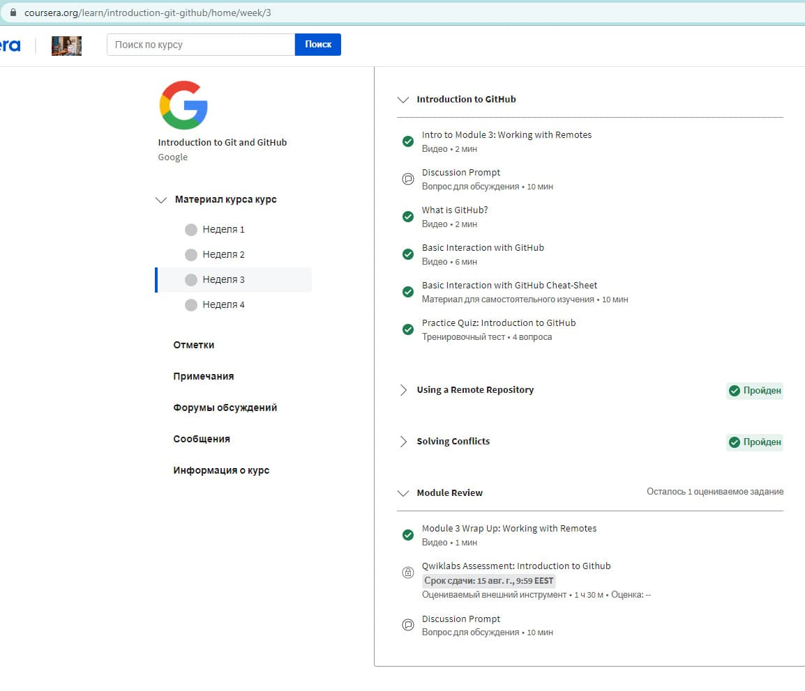
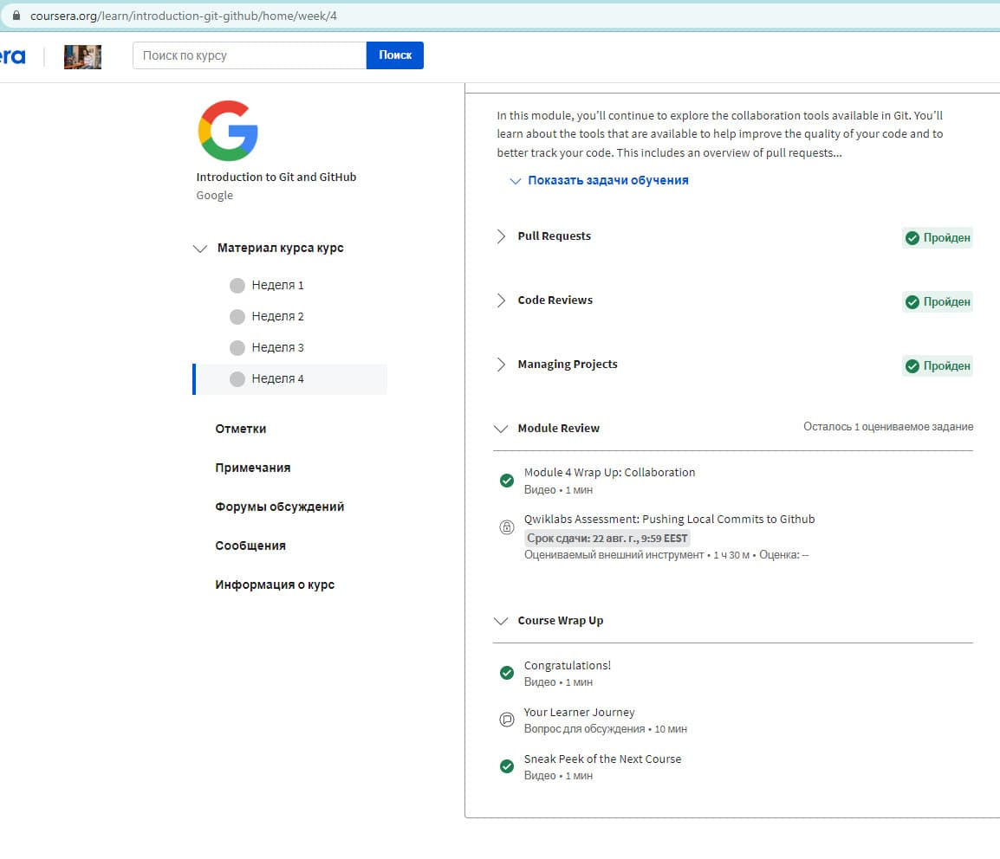
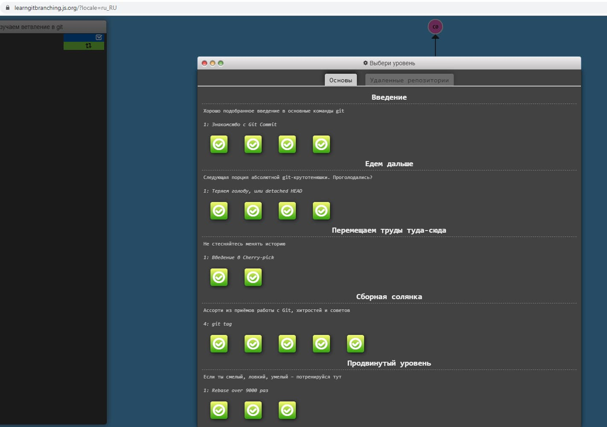
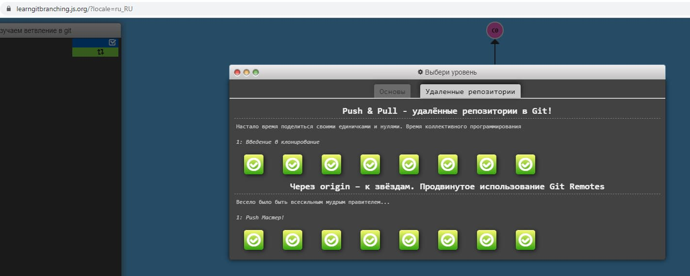

## Git for Team Collaboration

### Learn about Git and GitHub:

1. _Listen to weeks 3 and 4 of the Introduction to **Git** and **GitHub** course:_

Third Week

Fourth Week

2. _Complete the following levels here at [learngitbranching.js.org](https://learngitbranching.js.org/?locale=uk):_

Basics: Moving work back and forth

Remote repositories: Through origin - to the stars. Progressive use of Git Remotes

### Summary

*Very interesting information about ***Git*** from the video course.* 
*I was familiar with ***Git***, but I repeated some commands, as I did not use
and forgot them.*

*The [learngitbranching](https://learngitbranching.js.org/?locale=uk) game is very interesting and educational. Passed 2 times to consolidate
the material.* 
*I did not know about rebase, I liked it more than pull (it is more
cleaner), I will definitely use it.*