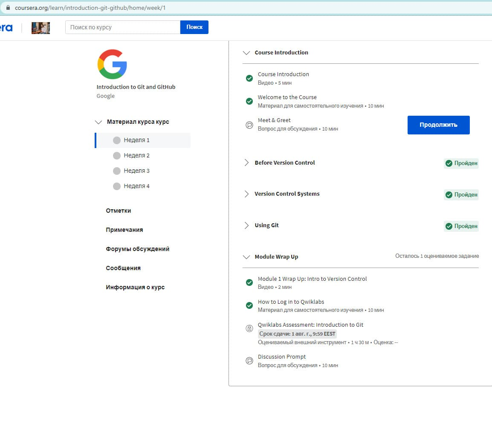
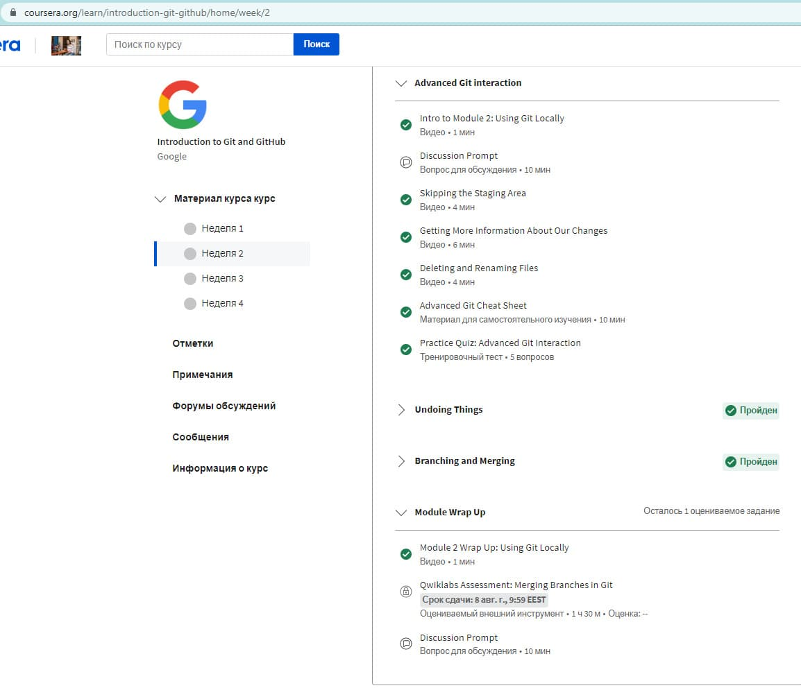
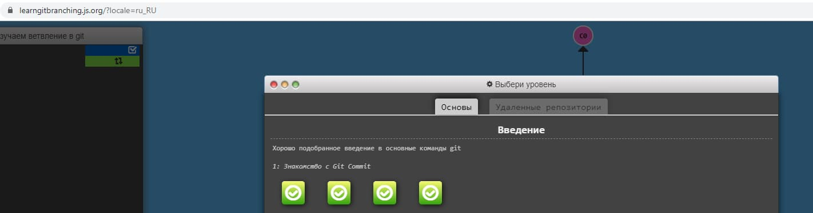
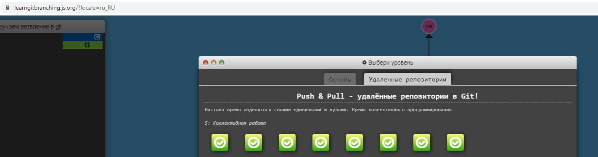

## Introduction to Git and GitHub

### Learn about Git and GitHub:

1. _Listen to weeks 1 and 2 of the Introduction to **Git** and **GitHub** course:_

First Week

Second Week

2. _Complete the following levels here at learngitbranching.js.org:_

Basics: Introduction Sequence

Remote Repositories: Push & Pull

