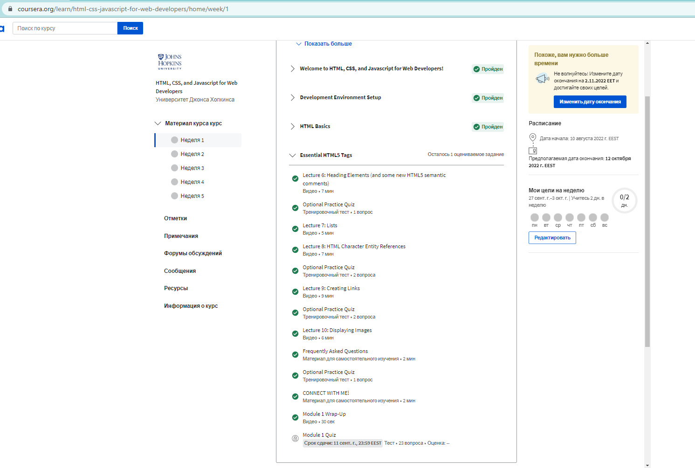
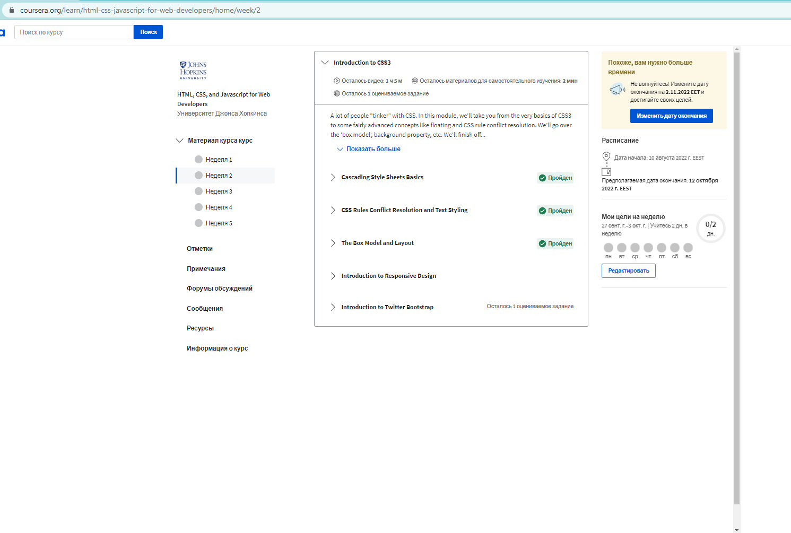
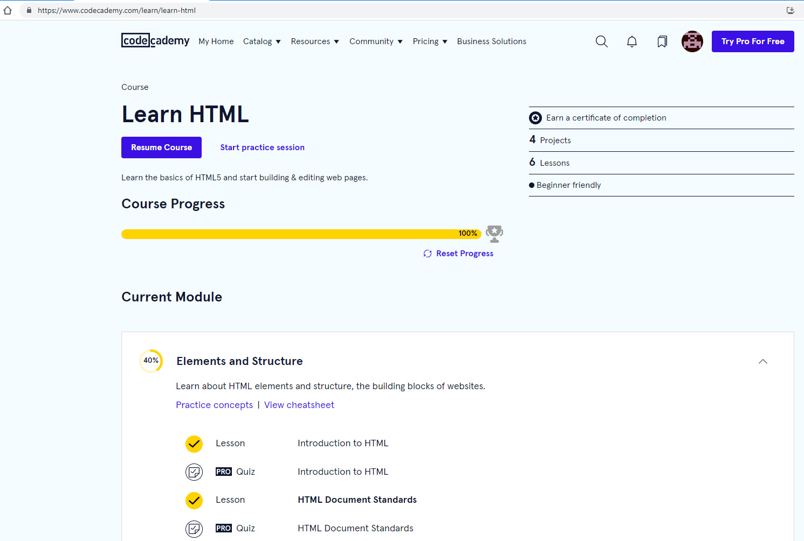
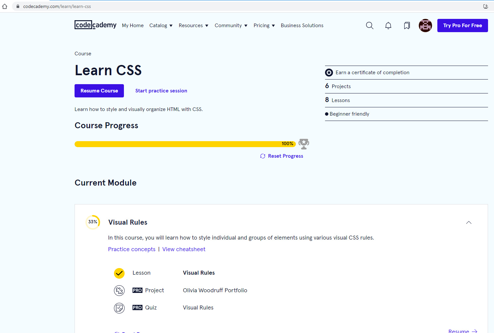

## Intro to HTML & CSS

### Learn about HTML and CSS:

1. _Listen to weeks 1 and 2 (before Introduction to Responsive Design) of the Introduction to **HTML** and **CSS** course:_

First Week

Second Week

2. _Learn the basics of HTML5 at [codecademy.com](https://www.codecademy.com/learn/learn-html):_

Basics of HTML5

Learn how to style and visually organize HTML with CSS

