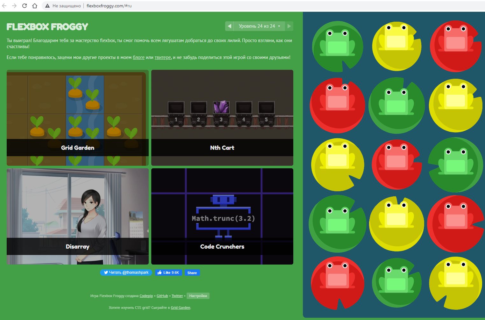
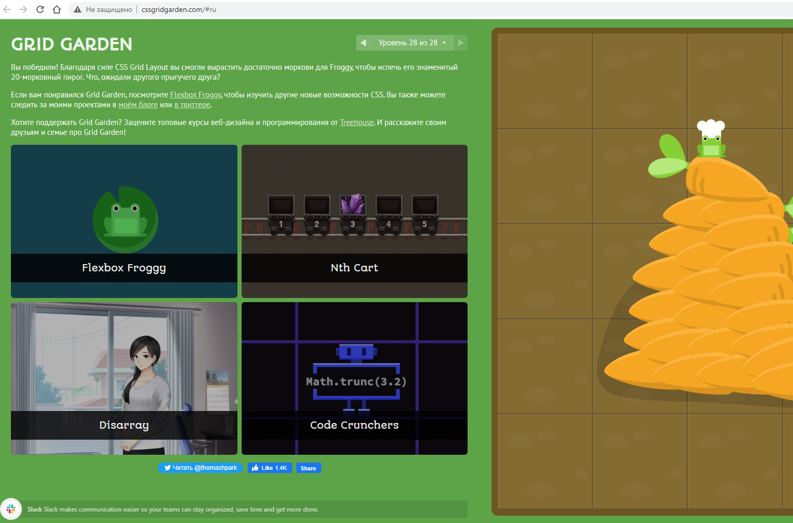

## Responsive Web Design

1. _Learn the basics of [Responsive web design basics](https://web.dev/i18n/en/responsive-web-design-basics/):_

   - [Set the viewport](https://web.dev/i18n/en/responsive-web-design-basics/#viewport)
   - [Size content to the viewport](https://web.dev/i18n/en/responsive-web-design-basics/#size-content)
   - [Use CSS media queries for responsiveness](https://web.dev/i18n/en/responsive-web-design-basics/#media-queries)
   - [How to choose breakpoints](https://web.dev/i18n/en/responsive-web-design-basics/#breakpoints)
   - [View media query breakpoints in Chrome DevTools](https://web.dev/i18n/en/responsive-web-design-basics/#devtools)

2. _CSS Flexbox:_

   - [Flex container properties](https://www.youtube.com/watch?v=EO8hH_2OwCU&list=PLM6XATa8CAG5mPV60dMmjMRrHVW4LmV2x&index=2&ab_channel=%D0%A4%D1%80%D1%96%D0%BB%D0%B0%D0%BD%D1%81%D0%B5%D1%80%D0%BF%D0%BE%D0%B6%D0%B8%D1%82%D1%82%D1%8E)
   - [Flex item properties](https://www.youtube.com/watch?v=uPYUgipiFcM&list=PLM6XATa8CAG5mPV60dMmjMRrHVW4LmV2x&index=2&ab_channel=%D0%A4%D1%80%D1%96%D0%BB%D0%B0%D0%BD%D1%81%D0%B5%D1%80%D0%BF%D0%BE%D0%B6%D0%B8%D1%82%D1%82%D1%8E)
   - [Flex-direction property](https://www.youtube.com/watch?v=cXAUxbu6X2E&list=PLM6XATa8CAG5mPV60dMmjMRrHVW4LmV2x&index=3&ab_channel=%D0%A4%D1%80%D1%96%D0%BB%D0%B0%D0%BD%D1%81%D0%B5%D1%80%D0%BF%D0%BE%D0%B6%D0%B8%D1%82%D1%82%D1%8E)

3. _CSS Grid Layout:_

   - [Grid та Flex. Основні поняття](https://www.youtube.com/watch?v=GV92IdMGFfA&list=PLM6XATa8CAG5pXQrW_kDaeZb_uIAMNZIm&index=1&ab_channel=%D0%A4%D1%80%D1%96%D0%BB%D0%B0%D0%BD%D1%81%D0%B5%D1%80%D0%BF%D0%BE%D0%B6%D0%B8%D1%82%D1%82%D1%8E)
   - [Визначення grid-сітки](https://www.youtube.com/watch?v=FPL4hnmA84A&list=PLM6XATa8CAG5pXQrW_kDaeZb_uIAMNZIm&index=2&ab_channel=%D0%A4%D1%80%D1%96%D0%BB%D0%B0%D0%BD%D1%81%D0%B5%D1%80%D0%BF%D0%BE%D0%B6%D0%B8%D1%82%D1%82%D1%8E)
   - [Керування елементами grid-сітки](https://www.youtube.com/watch?v=3AatkxA3LhY&list=PLM6XATa8CAG5pXQrW_kDaeZb_uIAMNZIm&index=3&ab_channel=%D0%A4%D1%80%D1%96%D0%BB%D0%B0%D0%BD%D1%81%D0%B5%D1%80%D0%BF%D0%BE%D0%B6%D0%B8%D1%82%D1%82%D1%8E)

4. [Flexbox Froggy](http://flexboxfroggy.com/) - гра для закріплення

Flexbox Froggy Result:

 

5. [Grid Garden](http://cssgridgarden.com/) - гра для закріплення

Grid Garden Result:

