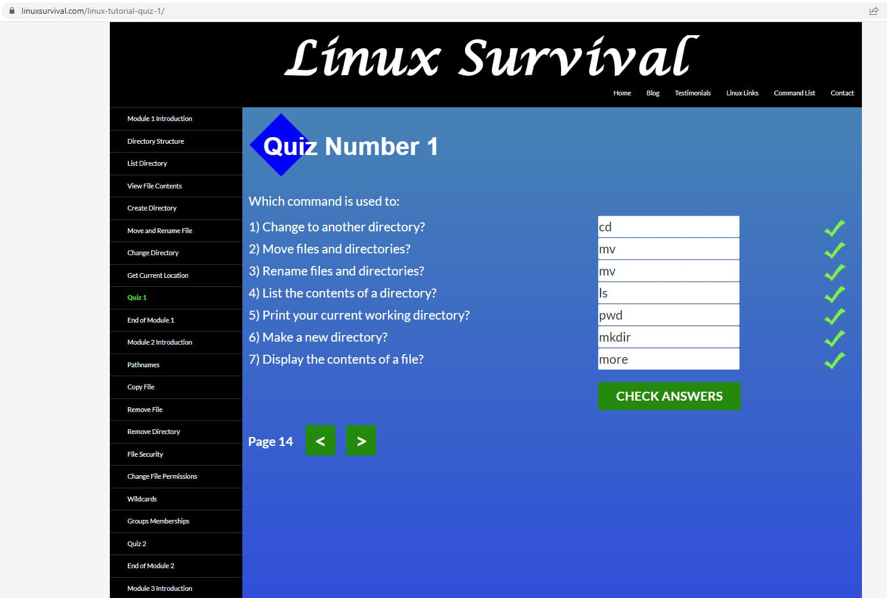
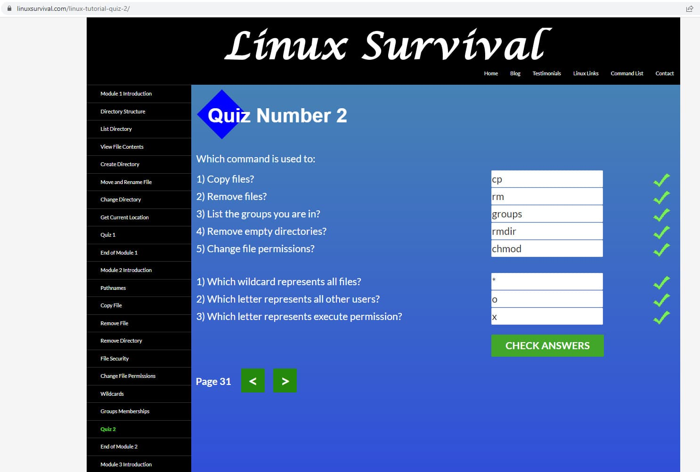
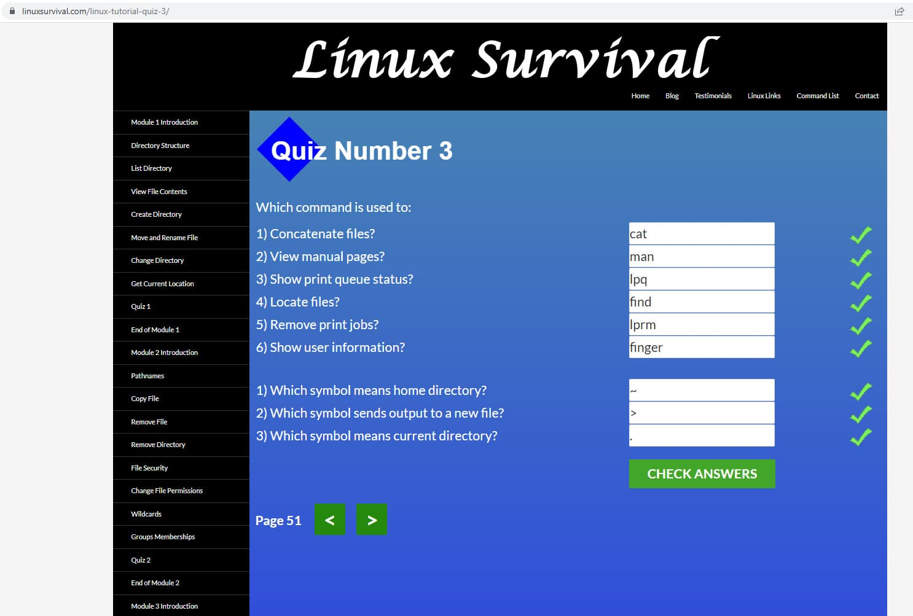
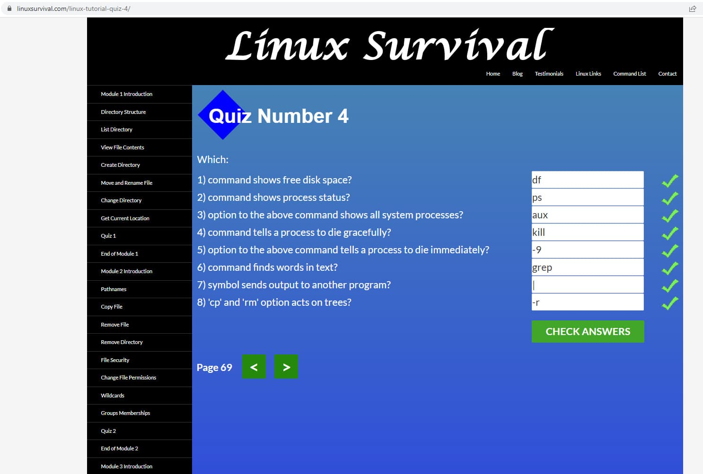

## Linux, Command Line, HTTP Tools

1. _Complete the course **"Linux Survival"** (4 modules):_

First Quiz

Second Quiz

Third Quiz

Fourth Quiz

2. _Read the articles about http requests:_

- HTTP Basics
   - URLs
   - Methods (get, post, put, delete)
   - Status codes (1xx, 2xx, 3xx, 4xx, 5xx)
   - Format of HTTP messages
- HTTP connection
- Identification and authentication
- Hashing

### Summary:

_I have never been well-acquainted with with **Linux** before, but some commands were familiar to me, I used them before in **bash**. The tasks were very interesting and useful for me. I will use **Linux OS** in the future._

_Two articles was very interesting for me and now it's clear, how occur interaction between client and server._